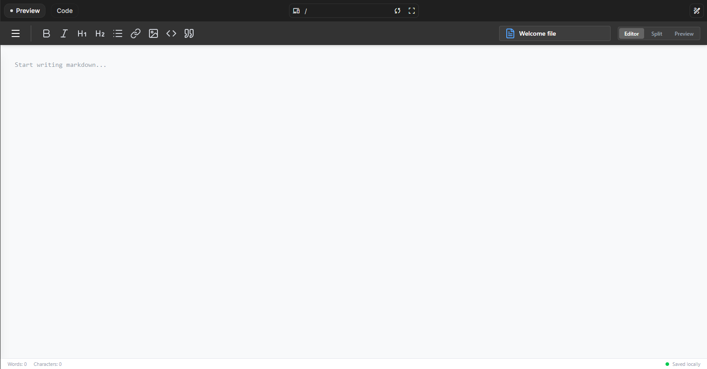

# 📝 MarkdownForge: Reverse Engineering StackEdit Engine


## 📝 Descrição do Projeto
O **MarkdownForge** é um laboratório de engenharia reversa focado na desconstrução e reconstrução da engine principal do **StackEdit**. O objetivo deste projeto foi isolar as funcionalidades core de edição e renderização síncrona, migrando de uma arquitetura baseada em frameworks (React) para uma implementação purista em **Vanilla JavaScript**.

Esta reconstrução foca na análise de persistência local (`localStorage`), manipulação direta do DOM para renderização de Markdown via engine de parseamento (Marked), e implementação de um sistema de arquivos puramente client-side que opera de forma resiliente em ambientes offline.

---


*Figura 1: Interface reconstruída focada em split-view e manipulação de fluxos de dados Markdown.*

## 🚀 Tecnologias Utilizadas
* **Core Engine:** Vanilla JavaScript (ES15+)
* **Parseamento:** Marked.js (Engine de processamento GFM)
* **Estilização:** Tailwind CSS v4 (Arquitetura de Design Atoms)
* **Bundling:** Vite (Pipeline de asset modular)
* **Ícones:** Lucide Icons (Renderização Dinâmica)
* **Persistência:** Browser Local Storage API

## 📊 Resultados e Funcionalidades
A engenharia reversa permitiu a criação de um sistema modularizado e desacoplado:
* **Engine de Split-View Síncrona:** Implementação de um observador de eventos no `textarea` que dispara o ciclo de renderização e atualização do DOM em tempo real.
* **Sistema de Arquivos Modular:** Gestão de estados internos via arrays de objetos serializados, permitindo operações de CRUD (Create, Read, Update, Delete) sem dependência de banco de dados externo.
* **Otimização de Performance:** Redução drástica do bundle size ao eliminar frameworks, mantendo a responsividade da interface através de manipulações granulares do DOM.
* **Persistência Offline:** Estratégia de salvamento automático que garante a integridade dos dados através de interceptadores de entrada (oninput).


*Figura 2: Análise da gestão de estado e estrutura de arquivos no Explorer dinâmico.*

## 🔧 Como Executar
1. Clone o repositório.
2. Certifique-se de ter o [Node.js](https://nodejs.org/) instalado.
3. Instale as dependências de desenvolvimento:
   ```bash
   npm install

